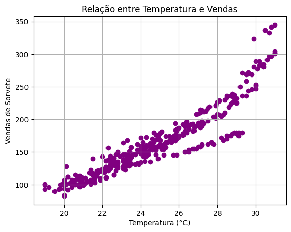
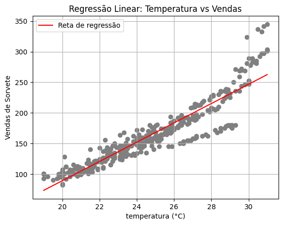

# Regressão Linear para vendas de sorvete

Este projeto aplica regressão linear para prever vendas de sorvete com base na temperatura. Utiliza MLflow para rastrear experimentos, registrar métricas e organizar o ciclo de vida do modelo. Executado no Azure Machine Learning Studio.

## Objetivo

Prever a quantidade de sorvetes vendidos em função da temperatura, ajudando no planejamento de produção e estoque da sorveteria Gelato Mágico.

## Tecnologias utilizadas

- Python
- Pandas
- Scikit-learn
- Matplotlib
- MLflow
- Azure Machine Learning Studio

## Metodologia

1. **Dados e Pré-processamento**
   - Dados fictícios criados com auxílio de IA generativa
   - Leitura de dados históricos de temperatura e vendas
   - Separação em treino e teste

2. **Treinamento do modelo**
   - Regressão Linear com Scikit-learn
   - Avaliação com métricas: MAE, RMSE, R²

3. **Visualização**
   - Gráfico de dispersão com reta de regressão
   - Interpretação visual da qualidade do ajuste
    
    #### Gŕafico de dispersão
   

   #### Gŕafico Regressão
   

4. **Rastreamento com MLflow**
   - Log de parâmetros e métricas
   - Registro do modelo

## Resultados

- **MAE**: 16.59  
- **RMSE**: 24.93  
- **R²**: 0.79
