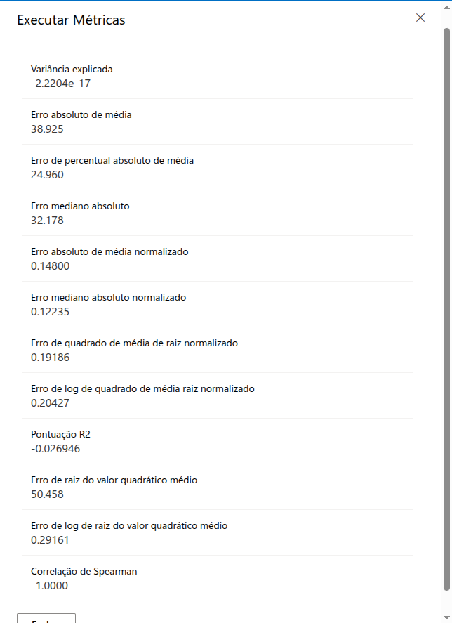

# Experimento AutoML: Previsão de Vendas de Sorvete

Este repositório documenta dois experimentos realizados no [Azure Machine Learning Studio](https://azure.microsoft.com/en-us/products/machine-learning/), com o objetivo de prever vendas de sorvete com base na temperatura ambiente. Os experimentos foram conduzidos utilizando duas abordagens distintas:

- **AutoML**: automação da seleção e treinamento de modelos.
- **Designer**: construção manual de pipeline com modelo de regressão linear.

Além dos experimentos realizados no Azure ML, este repositório também inclui um notebook com um modelo de regressão linear desenvolvido manualmente. O processo completo de treinamento e avaliação foi realizado utilizando Python e bibliotecas de machine learning, com execução também no ambiente do Azure ML. Para mais detalhes sobre esse notebook, consulte o arquivo de documentação [README.md do notebook](gelato_magico/gelato_magico_vendas.ipynb).

---

## Dados Utilizados

- **Fonte:** [Arquivo CSV](data/vendas_2024.csv), gerado com apoio de IA generativa, contendo três colunas:
  - `Data`: data da venda
  - `Temperatura`: temperatura ambiente em graus Celsius
  - `Vendas`: quantidade de sorvetes vendidos

> Para os experimentos, foram utilizadas apenas as colunas `Temperatura` e `Vendas`.

---

## Objetivo

Utilizar técnicas de regressão para prever o número de vendas de sorvete com base na temperatura ambiente.

---

## Experimento 1: AutoML

- **Ferramenta:** Azure Machine Learning Studio – AutoML
- **Tipo de tarefa:** Regressão
- **Modelos selecionados manualmente:**
  - `XGBoostRegressor`
  - `RandomForestRegressor`
- **Tempo limite de execução:** 15 minutos
- **Resultado:** O experimento não foi concluído totalmente devido ao tempo limite, mas cerca de 20 algoritmos foram executados e avaliados.

### Visualizações

- Lista de algoritmos executados, com métricas de erro e tempo de execução:

  
  

- Detalhes de execução de um modelo específico:

  

- Métricas de avaliação dos modelos:

  

---

## Experimento 2: Designer

- **Ferramenta:** Azure Machine Learning Studio – Designer
- **Pipeline criado:**
  - Importação do dataset
  - Divisão entre treino (80%) e teste (20%)
  - Aplicação do modelo `Linear Regression`
  - Avaliação de desempenho

### Esquema do Pipeline

Visualização do fluxo de componentes utilizados:

 

### Resultados

- Saída do módulo **Score Model**:

  

- Saída do módulo **Evaluate Model**:

  

---

## Conclusões

- O AutoML testou diversos modelos e entregou métricas úteis, mesmo com tempo limitado.
- O Designer permitiu uma abordagem mais controlada e rápida, ideal para testes simples.