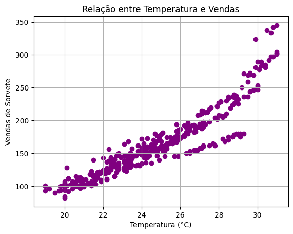
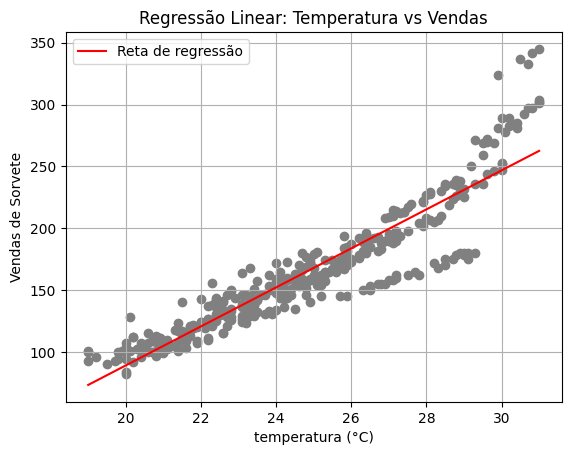

# Regressão Linear para Vendas de Sorvete

Este projeto aplica regressão linear para prever as vendas de sorvete com base na temperatura ambiente. Utiliza o MLflow para rastrear experimentos, registrar métricas e organizar o ciclo de vida do modelo. A execução foi realizada no Azure Machine Learning Studio.

---

## Objetivo

Prever a quantidade de sorvetes vendidos em função da temperatura, auxiliando no planejamento de produção e estoque da sorveteria **Gelato Mágico**.

---

## Tecnologias Utilizadas

- Python  
- Pandas  
- Scikit-learn  
- Matplotlib  
- MLflow  
- Azure Machine Learning Studio  

---

## Metodologia

1. **Dados e Pré-processamento**
   - Dados fictícios gerados com apoio de IA generativa
   - Leitura de dados históricos de temperatura e vendas
   - Separação dos dados em treino e teste

2. **Treinamento do Modelo**
   - Regressão Linear com Scikit-learn
   - Avaliação com as métricas: MAE, RMSE e R²

3. **Visualização**
   - Gráfico de dispersão com linha de regressão
   - Análise visual da qualidade do ajuste

   #### Gráfico de Dispersão  
   

   #### Gráfico de Regressão  
   

4. **Rastreamento com MLflow**
   - Registro de parâmetros e métricas
   - Armazenamento do modelo treinado

---

## Resultados

- **MAE**: 16.59  
- **RMSE**: 24.93  
- **R²**: 0.79  

---
